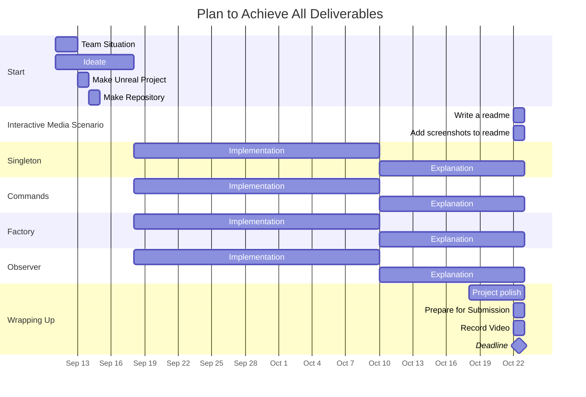

# EnginesCourseProject
 
#### Group Formation

I am working alone. However, that decision came after finding out that there wasn't a partner for me. My strategy is simple. First, I think about what project would benefit me the most. Since my GDW game is being made in Unreal Engine, I figured that working in Unreal Engine would serve me as good practice. With this constraint in mind, I talked to some people that I'd want to work with and probed them about their plans. It turned out people were either already in groups or were trying to avoid Unreal Engine. Therefore, I will be working alone. This is fine because it allows me to keep my scope small.

Roles:
Alex Anastasakis - 100892202 (contribution 100%)
 - Singleton
 - Factory
 - Obsersver
 - Command
 - Video report
 - Github management
 - Project management
 - Submission


#### Interactive Media Scenario Information

The interactive media scenario presented in this project is a snapshot of my GDW game. It is essentially a demo of the AI used by all NPCs in the game. The scenario shown off in the project is a live run of this AI working. The purpose is to pressure test it in different situations to make sure it doesn't break and works as intended. In this demo, the user's role is to watch and judge. It is intended to be "played" from the editor, where the user will place or move objects in the scene and watch how the AI responds or acts during play. However, the player can also move around and spawn things.


#### About the Project

As stated above, this project is a snapshot the AI system in my GDW game. It's a technical demo, not a game. 
This system is for all of the AI in an atmospheric, realtime strategy, tower defense game where you run and defend your town from nightly invasions by commanding your villagers. The AI solution implemented in this project is a hierarchical task network. Characters will be given a list of complex tasks based on their occupation, sorted by priority. They automatically perform tasks based on their world state - which is directly controlled by sensors.

### This Project as a Plugin

This project is an extracted version of what I initially made in my GDW game. Since I will be improving it in a new environment (this project), I am making this whole system a plugin. Now, I can easily re-import the updated version back to my GDW Game. I am only making the core system a plugin because the core doesn't depend on any external assets. 


## Use of Programming Patterns

The scope of the project is a little small because this hierarchical task network (HTN) system manages to use all patterns required for this assignment. Everything else is essentially padding to properly show off this HTN AI work.

This is a simplified, high level diagram of how this system is structured:


### Singleton
_Types introduced in this section: UTaskSubsystem, UPrimitiveTask._

My singleton implementation is very simple. Its just a globally ticking object that runs in the background and makes primitive tasks run. The reasoning for using a singleton this way is to separate the HTN component and individual primitive tasks. The goal is to execute tasks like this:
```
task = GetNextTask(CurrentPlan)
task->run()
```

The singleton class is **UTaskSubsystem** (Task.h). It derives from **UGameInstanceSubsystem** and **FTickableGameObject**. Deriving from these classes make it automatically spawn in the background and gives it the ability to tick - which is used to propagate tick events to instances of **UPrimitiveTask**. Implementing a singleton for this purpose benefits me greatly as a developer because it allows a task object to function completely independently from whoever's using it (the owning character). This is especially useful when making new primitive tasks and variations in the editor. Each class deriving from a **UPrimitiveTask** or child of is a template and acts as building blocks for AI behaviors.

**UPrimitiveTask** (Task.h) derives from **UObject**. On its own, it does nothing. It relies on an external object to call it's Tick() function.

Before a primitive task can be executed, it needs to be initialized. In its initializer, it will automatically register itself in the task subsystem. 

```
UPrimitiveTask::Initialize()
{
 // Get the subsystem instance and register this
 SubsystemId = TaskSubsystemInstance->RegisterPrimitiveTask(this)

 // Set other properties
}
```
In UTaskSubsystem::RegisterPrimitiveTask...
```
UTaskSubsystem::RegisterPrimitiveTask(UPrimitiveTask* TaskToRegister)
{
 if (TaskToRegister != nullptr)
 	//add it to registered tasks array
}
```

Once initialized, the task subsystem will make it tick..
```
UTaskSubsystem::Tick(float DeltaTime)
{
 Foreach registered primitive task:
 {
  if (RegisteredPrimitiveTask == nullptr)
 		remove RegisteredPrimitiveTask
 		continue

  // Once we know that RegisteredPrimitiveTask is valid
  RegisteredPrimitiveTask->Tick(DeltaTime)
 }
}
```

When primitive tasks are finished, they will automatically unregister themselves...
```
UPrimitiveTask::Tick(float DeltaTime)
{
 // Task code

 if (FinishCondition == true)
  OnTaskCompleted()
}

UPrimitiveTask::OnTaskCompleted()
{
 // Get the sybsystem instance and unregister this
 TaskSubsystemInstance->UnRegisterPrimitiveTask(this)

 // On task complete code..
}
```


### Factory
_Types introduced in this Section: UHTNComponent, USensor, FHTNPlan._

My implementation of a factory in this project is subtle but important. This pattern is used to instantiate instances of **UPrimitiveTask** for use on a local object (the instantiator). It is implemented in the same way to instantiate **USensor** types. 
A sensor is an object that links a world state to world data. Sensors are essentially the same as primitive task. It derives from **UObject** and relies on another object to call its Tick() function. Using the factory pattern in this way with these types was a no brainer for me because tasks and sensors are templates that need to be instantiated and set to work on a single object. 

In this project, **UHTNComponent** (HTNComponent.h) is the only class that uses sensors and tasks. **UHTNComponent** derives from **UActorComponent** and is the brain of the actor its attached to. It's a container and manager of a local HTN domain.

Sensors are instantiated and initialized before the game starts. 
**FSensorInitializer** (Sensor.h) is a struct that holds initializing properties. This is intended for easier configuring in the editor. 

```
// How sensors are made
UHTHComponent::InitializeComponent()
{
 // Initialization code...

 for each SensorInitializer in SensorInitializerArray
 {
  	SensorInstances.Add(NewObject(SensorInitializer.SensorClass))
  	SensorInstances[last]->Initialize()
 }
}
```

In a similar fasion, **UPrimitiveTask** types are instantiated when they are about to be executed. 

```
// How primitive tasks are made 
UHTNComponent::TickComponent()
{
 // is it time to make a new plan?
 if (TimeSinceLastPlan >= PlanningInterval)
 {
 	Planner->NewPlan()
 	CurrentTask->Stop()
 	CurrentTask = GetNextTaskInitialized(NewPlan) // HERE
  CurrentTask->Run()
 }

 // did the current task end?
 if (bGetNextTask)
 {
 	if (last task succeeded)
  {
 		CurrentTask = GetNextTaskInitialized(Plan) // HERE
   CurrentTask->Run()
  }
 }
}
```

Instantiation of tasks happen in a function called GetNextTaskInitialized.
```
UHTNComponent::GetNextTaskInitialized(PlanObject plan)
{
 taskClass = plan.GetNext()
 NextTask = NewObject(taskClass)
 NextTask->Initialize()
 return NextTask
}
```


### Command
_Types introduced in this Section: FPlanner, FHTNPlan, FWorldStateContainer, FWorldState, EPlanResult._

This project heavily uses the command design pattern. There are 3 implementations of the command design pattern in this project and its what helps keep the code clean and organized. The command design pattern is used in the sensors class, the planner class and the primitive tasks class. Since the rubric asks for one implementation for solo teams, I will explain the planner's implementation because it's the most comprehensive of the three. To start, some types need defining.
- **FPlanner** (Planner.h) is a class that generates a plan for a given **FWorldStateContainer**. This object initializes itself on construction and can be commanded to create a plan. 
- **FWorldStateContainer** (WorldState.h) is a wrapper struct for a list of individual **FWorldState**.
- **FWorldState** (WorldState.h) is a wrapper struct for a boolean that represents a fact about the local owner (for example, CanSeeGold = true).
- **FHTNPlan** (Planner.h) is a wrapper struct for a sequence of primitive tasks - ready to be fetched, instantiated, initialized and executed. It is the type returned when making a new plan. 
- **EPlanResult** (TaskResult.h) is an enum to describe the reason for returning after requesting a new plan.

I chose to make the planner a command object because it used to clutter the **UHTNComponent** class. I reflected on what the **UHTNComponent** class is, and reasoned that its a manager, that it should tell things what to do, not do the work itself. Thats why I chose to move the planning functionality into a command object. After this change, it made working with plans and planning much easier.

Setting up a planner is very easy. Just make one.. This is how I set them up:
```
UHTNComponent::InitializeComponent()
{
 // Initialization code
 // ...

 // Make planner object
 Planner = MakeUnique<FPlanner>(MyCachedListOfTasks, MyCachedWorldStateContainer)
}

// Another example
UHTNComponent::SetTasks(TaskListObject NewTasks)
{
 Plan.Reset()
 CurrentTask->Stop()

 // Make planner object
 Planner = MakeUnique<FPlanner>(NewTasks, CurrentWorldStateContainer)
}
```

Since FPlanner is not a UObject, I take advantage of constructors for initialization.
\*_Note for the following pseudocode. A "Task" is structured as follows:_
_- A task (**UTask** - Task.h) object is an Unreal Engine Data Asset that contains a list of methods._
_- A method (**FMethod** - Task.h) is structure that contains a list of primitive tasks (sometimes referred to as "steps")._
_- The idea is that a task object is a high level task. There can be many ways of completing a task. That's why a task can have many methods, ordered by priority._
_- A primitive task is a single step._

```
FPlanner::FPlanner(TasksToUse, WorldStateContainerToUse)
{
 // Initialize local variables...

 // Save all task requirements and effects
 TArray<IndividualWorldState> WorldStateBuffer
 for (Method in Task)
 {
  for (PrimitiveTask in Method)
  {
  	WorldStateBuffer.Add(task->requrement)
  	WorldStateBuffer.Add(task->effect)
  }
 }
 //Convert WorldStateBuffer into a FWorldStateContainer
 TaskStates = ConvertedBuffer // TaskStates is a class variable
}
```

Now, Planner->NewPlan() can be called. This function is a wrapper for MakePlan() which actually makes a plan.

```
// Only modify OutPlan if making a new plan succeeded
 bool FPlanner::NewPlan(FHTNPlan& OutPlan)
 {
 FHTNPlan NewPlan
 switch(MakePlan(NewPlan))  
 {  
 case Success:  
     if (NewPlan.Priority < OutPlan.Priority)  
     {  
        OutPlan = NewPlan
        return true
     }  
 case LowerPriority:  
     break;  
 case InProgress:  
     break;  
 case NoTasks:  
     break;  
 case Failed:  
     break;
 }  
 return false
}


// Try to actually make a plan
EPlanResult FPlanner::MakePlan(FHTHPlan& OutPlan)
{
 if (Tasks.IsEmpty()) return EPlanResult::NoTasks
 
 bool bIsValidTask
 OutPlan.Priority = -1
 for (Task in GivenTasks)
 {
 	OutPlan.Priority++;
 
 	for (Method in Task.Methods)
 	{
 		bool bIsValidMethod = true
 
 		FWorldStateContainer Hypothetical = copy of the worldstate container we want to compare
 
 		for (PrimitiveTask in Method.Steps)
 		{	
 			// can this step be performed? Is this step's requirement met?
 			// compare against world state
 			const FWorldStateContainer Req = Step->Requirement
 			if (Req != Hypothetical)
 			{
 				bIsValidMethod = false
 				break
 			}
 
 			// At this point, step is valid
 			// update hypothetical world state as if this action were to be executed successfully
 			const FWorldStateContainer Eff = Step->Effect
 			Hypothetical.SetToMatch(Eff)
 		}
 		if (bIsValidMethod)
 		{
 			bIsValidTask = true
 			// add every step of method to plan
 			for (int i = 0; i < Method.Steps.Num(); i++)
 			{
 				OutPlan.Add(Method.Steps[i])
 			}
 			break
 		}
 	}
 	
 	if (bIsValidTask)
 	{
 		return EPlanResult::Success;
 	}
 }
 
 return EPlanResult::Failed;
}
```

## Project Management

This gantt chart is an accurate representation of the development process.



To help me keep track of my momentum in this project, I used a kanban board in Obsidian. This is a screenshot of the current state (October 22 2025, 3:26 PM)


